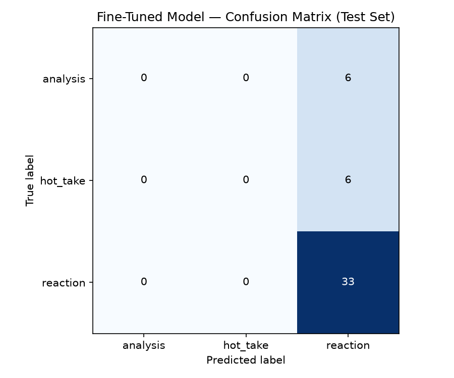

# TakeMeter

A fine-tuned text classifier that categorizes discourse quality in the r/soccer subreddit into three classes: `analysis`, `hot_take`, and `reaction`.

**Course:** CodePath AI201 — Applications of AI Engineering (Week 3)
**Base model:** `distilbert-base-uncased`
**Zero-shot baseline:** Groq `llama-3.3-70b-versatile`

> Design rationale and decision rules live in [`planning.md`](./planning.md). This README is the final project report.

---

## Community

<!-- Which subreddit, why it was chosen, and why discourse quality is a meaningful axis to classify here. Summarize from planning.md §1. -->

_TODO_

---

## Labels

<!-- The 3 labels with one-line definitions. Link to planning.md §2 for full definitions, examples, and edge-case decision rules. -->

| Label | Definition |
| --- | --- |
| `analysis` | _TODO_ |
| `hot_take` | _TODO_ |
| `reaction` | _TODO_ |

---

## Data Collection

<!-- Source, method (PRAW / manual), date range, filters applied, final label distribution, and any class-balancing steps. Note the pre_labeled column convention. -->

_TODO_

| Label | Count |
| --- | --- |
| `analysis` | _TODO_ |
| `hot_take` | _TODO_ |
| `reaction` | _TODO_ |
| **Total** | _TODO_ |

---

## Fine-tuning Approach

<!-- Base model, train/val/test split, key hyperparameters (epochs, LR, batch size, max length), and the Colab environment. Note: training happens in Colab, not this repo. -->

_TODO_

---

## Baseline

<!-- Zero-shot Groq llama-3.3-70b-versatile setup: the prompt used, how outputs were parsed into labels, and any failure modes. -->

_TODO_

---

## Evaluation Report

<!-- Pull numbers from evaluation_results.json and embed confusion_matrix.png. Compare fine-tuned vs. baseline against the success criteria in planning.md §6. -->

_TODO: overall accuracy, per-class precision/recall/F1, fine-tuned vs. baseline._

---

## Reflection

<!-- What worked, what didn't, hardest annotation boundaries, error patterns from failure analysis, and what you'd do differently with more time. -->

_TODO_

---

## AI Usage

<!-- Disclose where AI assistance was used: label stress-testing, annotation pre-labeling (pre_labeled column), failure analysis, and any code/writing help. Per planning.md AI Tool Plan. -->

_TODO_
